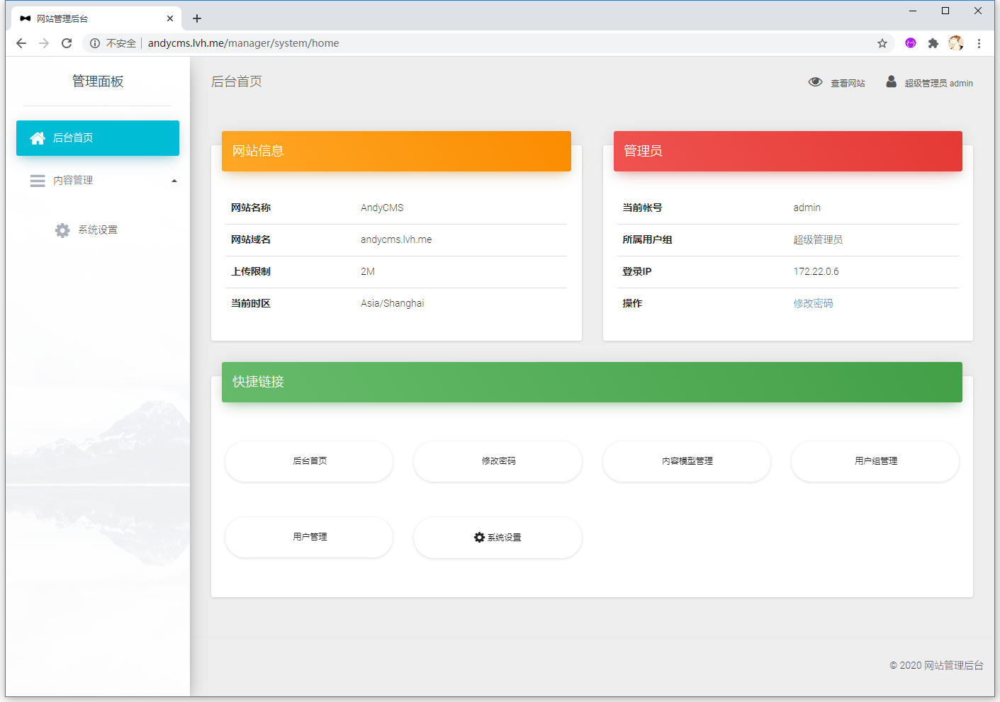

# AndyCMS
一个基于 [CodeIgniter 3](https://codeigniter.org.cn/docs) 与 [DiliCMS](https://github.com/mingfunwong/DiliCMS) 的快速开发内容管理系统。
它是无业务逻辑的，面向 CodeIgniter 开发者的自由灵活的系统，致力于为开发者提供最简单，灵活，实用的后台 CMS 系统。

## Author
[Mingfun Wong](https://github.com/mingfunwong)

## License
MIT License
